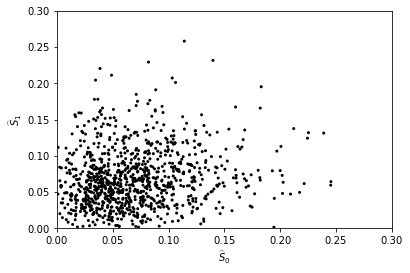
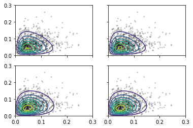

Counterfactuals with bivariate beta estimators
==============================================

First, let us make the necessary imports

.. code:: ipython3

    import sys
    # Add the parent directory to the path to be able to import whatif
    sys.path.append("../")

    import numpy as np
    from matplotlib import pyplot as plt
    from whatif import simulate_uplift_bb
    from whatif.cf import BivariateBeta, GeneralizedBivariateBeta, NoisyBeta, Simplex4DAxes

We will generate data artificially instead of using an uplift model on
real data. For an example of estimation from real data, see the notebook
`Counterfactuals with simple
estimators <Counterfactuals_with_simple_estimators.ipynb>`__. ``l_0``
and ``l_1`` dictate the estimator variance of the uplift scores (higher
values means less variance), while ``m`` dictates the distribution of
the counterfactuals:

.. math::
    \begin{align}
        \alpha &= \frac{m_1}M \\
        \beta  &= \frac{m_2}M \\
        \gamma &= \frac{m_3}M \\
        \delta &= \frac{m_4}M
    \end{align}

with :math:`M=m_1+m_2+m_3+m_4`. Also, larger values of
:math:`M` means that individual counterfactuals are more concentrated
around their means (the population counterfactuals), while lower values
of :math:`M` means that the individual counterfactuals are closer to
either 0 or 1.

.. code:: ipython3

    random_state = 12
    l_0 = 100
    l_1 = 100
    m = np.array([50, 3, 3, 1])
    mu = m / np.sum(m)
    data = simulate_uplift_bb([50, 3, 3, 1], 1000, random_state=12, noise="beta", l_0=l_0, l_1=l_1)

Let’s plot the uplift scores to have an idea of their distribution.

.. code:: ipython3

    scatter_params = {
        "marker": ".",
        "c": "black",
        "edgecolors": "none"
    }

    plt.scatter(data.S_0_hat, data.S_1_hat, **scatter_params)
    plt.xlabel("$\\widehat S_0$")
    plt.ylabel("$\\widehat S_1$")
    plt.xlim(0, 0.3)
    plt.ylim(0, 0.3)
    plt.show()

Now, we fit the four different bivariate beta models: with either
Dirichlet distribution (``BivariateBeta``) or generalized Dirichlet
distribution (``GeneralizedBivariateBeta``), and either with an attempt
to model the estimator variance of the uplift scores (``NoisyBeta``) or
not.

.. code:: ipython3

    model_bb = BivariateBeta()
    model_bb.fit(data.S_0_hat, data.S_1_hat)
    model_gbb = GeneralizedBivariateBeta()
    model_gbb.fit(data.S_0_hat, data.S_1_hat)
    model_nbb = NoisyBeta(l_0, l_1, BivariateBeta)
    model_nbb.fit(data.S_0_hat, data.S_1_hat)
    model_ngbb = NoisyBeta(l_0, l_1, GeneralizedBivariateBeta)
    model_ngbb.fit(data.S_0_hat, data.S_1_hat)

.. parsed-literal::

    2.0381838788597552e-08

To have a visual representation of the fitted distribution, we first
compute their probability density function. We use
``show_progress=True`` because computing the pdf of the ``NoisyBeta``
distribution takes longer, due to the 2D integrals.

.. code:: ipython3

    delta = 0.01
    X_0 = np.arange(0.001, 0.3, delta)
    X_1 = np.arange(0.001, 0.3, delta)
    X_0, X_1 = np.meshgrid(X_0, X_1)

    pdf_bb = model_bb.pdf(X_0.flatten(), X_1.flatten())
    pdf_bb.shape = X_0.shape
    pdf_gbb = model_gbb.pdf(X_0.flatten(), X_1.flatten())
    pdf_gbb.shape = X_0.shape
    pdf_nbb = model_nbb.pdf(X_0.flatten(), X_1.flatten(), show_progress=True)
    pdf_nbb.shape = X_0.shape
    pdf_ngbb = model_ngbb.pdf(X_0.flatten(), X_1.flatten(), show_progress=True)
    pdf_ngbb.shape = X_0.shape

.. parsed-literal::

      0%|          | 0/900 [00:00<?, ?it/s]

.. parsed-literal::

      0%|          | 0/900 [00:00<?, ?it/s]

And then we plot the pdf as countour plots.

.. code:: ipython3

    fig, axs = plt.subplots(nrows=2, ncols=2, sharex=True, sharey=True)

    for i, pdf in enumerate([pdf_bb, pdf_gbb, pdf_nbb, pdf_ngbb]):
        axs[i // 2, i % 2].scatter(data.S_0_hat, data.S_1_hat, **scatter_params, alpha=0.2)
        axs[i // 2, i % 2].contour(X_0, X_1, pdf)

    plt.xlim(0, 0.3)
    plt.ylim(0, 0.3)
    plt.show()

The estimated population-level counterfactuals are:

.. code:: ipython3

    def cf_to_str(mu):
        return "alpha = {:5.1%}, beta = {:5.1%}, gamma = {:5.1%}, delta = {:5.1%}".format(*mu)
    model_names = ["BB", "GBB", "NBB", "NGBB"]
    for i, model in enumerate([model_bb, model_gbb, model_nbb, model_ngbb]):
        print("{:5} :".format(model_names[i]), cf_to_str(model.population_cf()))
    print("truth :", cf_to_str(mu))

.. parsed-literal::

    BB    : alpha = 86.5%, beta =  6.6%, gamma =  6.5%, delta =  0.4%
    GBB   : alpha = 86.5%, beta =  6.6%, gamma =  6.5%, delta =  0.4%
    NBB   : alpha = 88.0%, beta =  5.1%, gamma =  5.0%, delta =  1.9%
    NGBB  : alpha = 88.0%, beta =  5.0%, gamma =  4.9%, delta =  2.0%
    truth : alpha = 87.7%, beta =  5.3%, gamma =  5.3%, delta =  1.8%

We can also compute individual-level counterfactuals: suppose we have a
new customer with :math:`S_0=0.1` and :math:`S_1=0.05`:

.. code:: ipython3

    for i, model in enumerate([model_bb, model_gbb, model_nbb, model_ngbb]):
        print("{:5} :".format(model_names[i]), cf_to_str(model.individual_cf(np.array([0.1]), np.array([0.05]))[0]))

.. parsed-literal::

    BB    : alpha = 85.4%, beta =  9.6%, gamma =  4.6%, delta =  0.4%
    GBB   : alpha = 85.4%, beta =  9.6%, gamma =  4.6%, delta =  0.4%
    NBB   : alpha = 87.3%, beta =  6.8%, gamma =  4.0%, delta =  2.0%
    NGBB  : alpha = 87.3%, beta =  6.7%, gamma =  3.9%, delta =  2.1%
