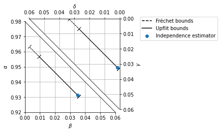

Counterfactuals with simple estimators
======================================

First step, importing packages.

.. code:: ipython3

    import sys
    # Add the parent directory to the path to be able to import whatif
    sys.path.append("../")

    import numpy as np
    import pandas as pd
    import matplotlib.pyplot as plt
    from sklearn.ensemble import RandomForestClassifier
    from openml.datasets import get_dataset
    from whatif import Dataset
    from whatif.uplift import EasyEnsemble, TLearnerWrapper, calibrate_score
    from whatif.cf import frechet_bounds, uplift_bounds, Independence, Simplex4DAxes

Let us load the uplift dataset with Orange customer data from OpenML.

.. code:: ipython3

    dataset = get_dataset("churn-uplift-orange").get_data()[0]

And convert it to a Dataset object to train an uplift model on it

.. code:: ipython3

    dataset = Dataset(
        X = dataset.drop(["y", "t"], axis=1),
        y = (dataset.y == 1).to_numpy(),
        t = (dataset.t == 1).to_numpy()
    )
    dataset.X = pd.get_dummies(dataset.X).to_numpy().astype("float32")

Let us train an uplift model and predict the uplift scores
:math:`S_0(x)` and :math:`S_1(x)`. In practice you would want to divide
the dataset into a training and a test set, however for the purpose of
this example, this does not matter. We use the EasyEnsemble methodology
to mitigate class imbalance.

.. code:: ipython3

    model = EasyEnsemble(
        TLearnerWrapper(RandomForestClassifier(n_estimators=100)),
        n_folds=10
    )
    model.fit(dataset)
    pred = model.predict(dataset)
    S_0 = pred["control"]
    S_1 = pred["target"]

Since the scores :math:`S_0(x)` and :math:`S_1(x)` are biased due to the
class balancing with EasyEnsemble, we need to re-calibrate them. We do
this using a calibration formula that ensure that the mean predicted
score is equal to the average probability of the outcome to be positive:

.. math:: \mathbb E[S_0(x)] = P(\mathbf{y}_0=1).

.. code:: ipython3

    P_y_0 = np.mean(dataset.y[~dataset.t])
    P_y_1 = np.mean(dataset.y[dataset.t])

    print("Means before calibration: {:.1%}, {:.1%}".format(np.mean(S_0), np.mean(S_1)))
    print("Target means:  {:.1%}, {:.1%}".format(P_y_0, P_y_1))
    S_0 = calibrate_score(calibrate_score(S_0, P_y_0), P_y_0)
    S_1 = calibrate_score(calibrate_score(S_1, P_y_1), P_y_1)
    print("Means after calibration: {:.1%}, {:.1%}".format(np.mean(S_0), np.mean(S_1)))

.. parsed-literal::

    Means before calibration: 48.4%, 45.1%
    Target means:  3.6%, 3.4%
    Means after calibration: 3.6%, 3.4%

We can now execute the basic counterfactual estimators: we want to
estimate the probability distribution

.. math::
    \begin{align}
        \alpha &= P(\mathbf y_0=0, \mathbf y_1=0) \\
        \beta  &= P(\mathbf y_0=1, \mathbf y_1=0) \\
        \gamma &= P(\mathbf y_0=0, \mathbf y_1=1) \\
        \delta &= P(\mathbf y_0=1, \mathbf y_1=1).
    \end{align}

The first one is the Fréchet bounds,

.. math:: \max\{0, P(A)+P(B)-1\}\le P(A,B)\le\min\{P(A),P(B)\}.

.. code:: ipython3

    frechet_lb, frechet_ub = frechet_bounds(np.mean(S_0), np.mean(S_1))

    def print_bounds(lb, ub):
        for i, letter in enumerate(["alpha", "beta ", "gamma", "delta"]):
            print("{:5.1%} <= {} <= {:5.1%}".format(lb[i], letter, ub[i]))

    print_bounds(frechet_lb, frechet_ub)

.. parsed-literal::

    93.0% <= alpha <= 96.4%
     0.3% <= beta  <=  3.6%
     0.0% <= gamma <=  3.4%
     0.0% <= delta <=  3.4%

Then, our new uplift bounds,

.. math::

   \mathbb E_{\mathbf x}[\max\{P(A \mid\mathbf x) + P(B \mid\mathbf x) - 1\}] \le P(A, B) \le\mathbb E_{\mathbf x}[\min\{P(A\mid\mathbf x), P(B,\mid\mathbf x)\}].

.. code:: ipython3

    uplift_lb, uplift_ub = uplift_bounds(S_0, S_1)
    print_bounds(uplift_lb, uplift_ub)

.. parsed-literal::

    93.0% <= alpha <= 95.7%
     0.9% <= beta  <=  3.6%
     0.6% <= gamma <=  3.4%
     0.0% <= delta <=  2.7%

And finally, our new estimator based on conditional independence,

.. math::

   P(A,B)\approx\mathbb E_{\mathbf x}[P(A\mid\mathbf x)P(B\mid\mathbf x)].

.. code:: ipython3

    ind_model = Independence()
    ind_model.fit(S_0, S_1)
    ind_pred = ind_model.population_cf()
    for i, letter in enumerate(["alpha", "beta ", "gamma", "delta"]):
        print("{} ~ {:5.1%}".format(letter, ind_pred[i]))

.. parsed-literal::

    alpha ~ 93.1%
    beta  ~  3.5%
    gamma ~  3.2%
    delta ~  0.1%

Let us plot the resulting estimators on a custom matplotlib Axes.

.. code:: ipython3

    fig = plt.figure()
    ax = Simplex4DAxes(fig)
    ax.set_ylabel("$\\alpha$")
    ax.set_xlabel("$\\beta$")
    ax.set_zlabel("$\\delta$")
    ax.set_wlabel("$\\gamma$")
    ax.set_xlim(0, 0.06)
    ax.set_ylim(0.92, 0.98)
    ax.set_zlim(0, 0.06)
    ax.set_wlim(0, 0.06)

    ax.plot_bounds(frechet_lb, frechet_ub, linestyle="dashed", color="black", label="Fréchet bounds")
    ax.plot_bounds(uplift_lb, uplift_ub, color="black", label="Upflit bounds")
    ax.scatter(ind_pred[1], ind_pred[0], ind_pred[3], ind_pred[2], label="Independence estimator")

    plt.legend(
        loc="upper left",
        bbox_to_anchor=(1.2, 1.05)
    )

    plt.show()

